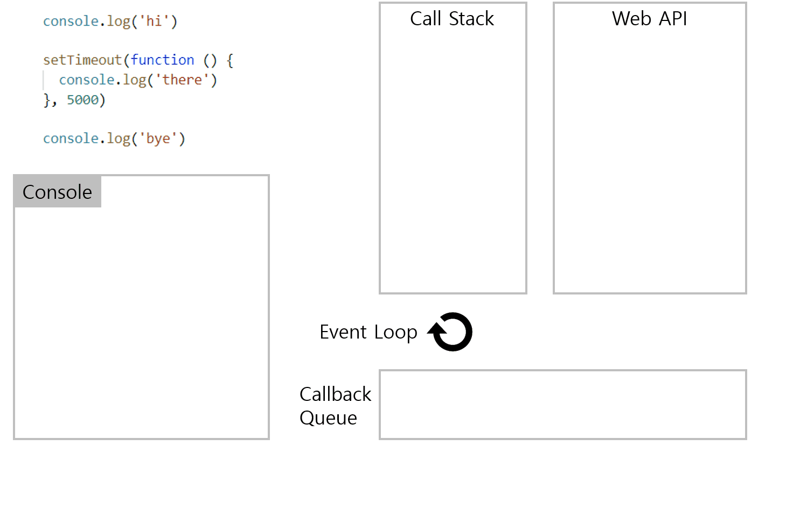

# 자바스크립트 동작 원리([이벤트 루프](#이벤트루프)(Event Loop))

- gif 출처: https://beomy.github.io/tech/javascript/javascript-runtime/

> - 일반적인 작업은 [콜스택](#콜스택)(Call Stack)에서 이루어진다
> - 시간이 소요되는 작업들(setTimeout, 이벤트, HTTP 요청 메서드 등)은 [WebAPI](#webapi)에서 대기하다가 [콜백큐](#콜백큐)(Callback Queue)로 보내진다.
> - Call Stack이 비워져 있을때만 Callback Queue에 저장되어있던 작업들을 Call Stack으로 보낸다.

---

# 용어 공부

## 이벤트루프

- 이벤트 루프(Event Loop)는 call stack이 다 비워지면 callback queue에 존재하는 함수를 하나씩 call stack으로 옮기는 역할을 한다.

## 콜스택

- 콜스택(Call Stack)은 실행된 코드의 환경을 저장하는 자료구조로, 함수 호출 시 이곳에 저장된다. 어떤 함수를 저장하면 스택에 쌓고 또 다른 함수를 호출하면 그 다음 스택에 쌓이면서 가장 위에 쌓인 함수를 가장 먼저 처리한다. LIFO(Last in First Out)

## webAPI

- Web API는 브라우저에서 제공하는 API로 DOM, Ajax, TimeOut 등이 있다. CallStack에서 실행된 비동기함수는 Web API를 호출하고, Web API는 콜백 함수를 Task Queue에 넣는다.

## 콜백큐

- 콜백큐(Callback Queue)는 함수를 저장하는 자료구조로, Call Stack과 다르게 가장 먼저 들어온 함수를 가장 먼저 처리한다.
